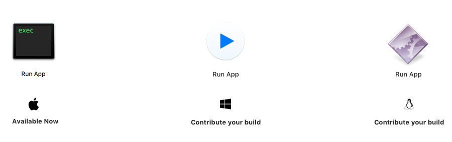

# Run Static App
Chances are, you'll need to distribute your static web app or prototype
privately in something like ZIP due to company's security policies.

In order for non-technical people to open your work, you can include these
little executables that will **launch your static app on a local HTTP server.**

#### [Download latest executables](https://github.com/kysely/run-static-app/releases/latest)

## Create your own build
1. Fork and clone this repo
2. Do your magic inside `run_app.py`
3. `pip install pyinstaller`
4. Run `./build.sh` (or commands from it)

Please note that [`pyinstaller`](http://www.pyinstaller.org) lets you create
an executable **only** for the native platform. If you need execs for more
platforms, you'll need to invoke builds directly in the individual OSs.
Also, custom icon for a command line executable is only available on Windows.

---

### MIT License